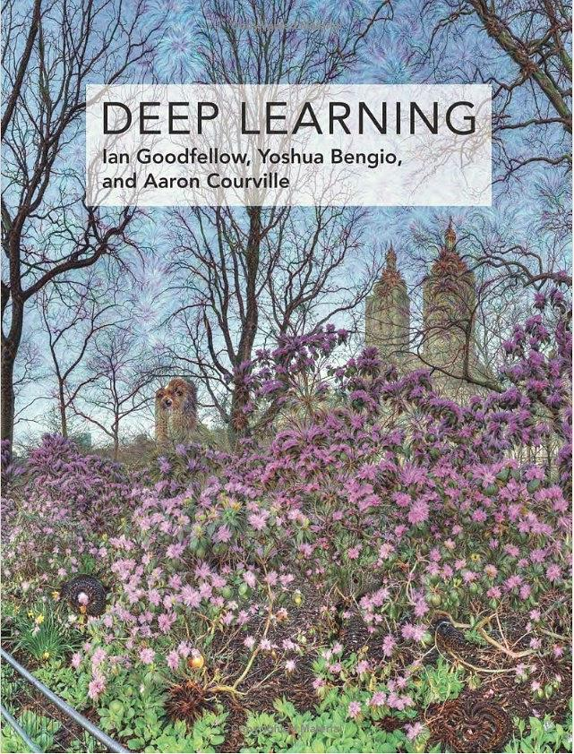

# Deep Learning

《**深度学习**》是深度学习领域唯一的综合性图书，全称也叫做**深度学习 AI圣经(Deep Learning)**，由三位全球知名专家IanGoodfellow、YoshuaBengio、AaronCourville编著，全书囊括了数学及相关概念的背景知识，包括线性代数、概率论、信息论、数值优化以及机器学习中的相关内容。同时，它还介绍了工业界中实践者用到的深度学习技术，包括深度前馈网络、正则化、优化算法、卷积网络、序列建模和实践方法等，并且调研了诸如自然语言处理、语音识别、计算机视觉、在线推荐系统、生物信息学以及视频游戏方面的应用。最后，深度学习全书还提供了一些研究方向，涵盖的理论主题包括线性因子模型、自编码器、表示学习、结构化概率模型、蒙特卡罗方法、配分函数、近似推断以及深度生成模型，适用于相关专业的大学生或研究生使用。

可以下载《深度学习》的中文版[pdf](https://github.com/MingchaoZhu/DeepLearning/raw/master/DL%E4%B8%AD%E6%96%87.pdf)和英文版[pdf](https://github.com/MingchaoZhu/DeepLearning/raw/master/DL%E8%8B%B1%E6%96%87.pdf)直接阅读。

---

《深度学习》可以说是深度学习与人工智能的入门宝典，许多算法爱好者、机器学习培训班、互联网企业的面试，很多都参考这本书。但本书晦涩，加上官方没有提供代码实现，因此某些地方较难理解。本站**基于数学推导和产生原理重新描述了书中的概念**，并用**Python** (numpy 库为主) 复现了书本内容（推导过程和代码实现均见**pdf文件**，重要部分的实现代码也放入**code文件夹**中）。

然而我水平有限，但我真诚地希望这项工作可以帮助到更多人学习深度学习算法。我需要大家的建议和帮助。如果你在阅读中遇到有误或解释不清的地方，希望可以汇总你的建议，提issue （最好不要一个一个地提）。如果你也想加入这项工作书写中或有其他问题，可以联系我的邮箱：deityrayleigh@gmail.com。

写的过程中参考了较多网上优秀的工作，所有参考资源保存在了`reference.txt`文件中。

| 中文章节 | 英文章节 | 下载 |
| ------------ | ------------ | ------------ |
| 第一章 前言 | 1 Introduction |  |
| 第二章 线性代数 | 2 Linear Algebra | [pdf](https://github.com/MingchaoZhu/DeepLearning/raw/master/%E7%BA%BF%E6%80%A7%E4%BB%A3%E6%95%B0.pdf) |
| 第三章 概率与信息论                 | 3 Probability and Information Theory | [pdf](https://github.com/MingchaoZhu/DeepLearning/raw/master/%E6%A6%82%E7%8E%87%E4%B8%8E%E4%BF%A1%E6%81%AF%E8%AE%BA.pdf) |
| 第四章 数值计算                     | 4 Numerical Computation | [pdf](https://github.com/MingchaoZhu/DeepLearning/raw/master/%E6%95%B0%E5%80%BC%E8%AE%A1%E7%AE%97.pdf) |
| 第五章 机器学习基础                 | 5 Machine Learning Basics | [pdf](https://github.com/MingchaoZhu/DeepLearning/raw/master/%E6%9C%BA%E5%99%A8%E5%AD%A6%E4%B9%A0%E5%9F%BA%E7%A1%80.pdf) |
| 第六章 深度前馈网络                 | 6 Deep Feedforward Networks | [pdf](https://github.com/MingchaoZhu/DeepLearning/raw/master/%E6%B7%B1%E5%BA%A6%E5%89%8D%E9%A6%88%E7%BD%91%E7%BB%9C.pdf) |
| 第七章 深度学习中的正则化           | 7 Regularization for Deep Learning | [pdf](https://github.com/MingchaoZhu/DeepLearning/raw/master/%E6%B7%B1%E5%BA%A6%E5%AD%A6%E4%B9%A0%E4%B8%AD%E7%9A%84%E6%AD%A3%E5%88%99%E5%8C%96.pdf) |
| 第八章 深度模型中的优化 | 8 Optimization for Training Deep Models | [pdf](https://github.com/MingchaoZhu/DeepLearning/raw/master/%E6%B7%B1%E5%BA%A6%E6%A8%A1%E5%9E%8B%E4%B8%AD%E7%9A%84%E4%BC%98%E5%8C%96.pdf) |
| 第九章 卷积网络 | 9 Convolutional Networks | [pdf](https://github.com/MingchaoZhu/DeepLearning/raw/master/%E5%8D%B7%E7%A7%AF%E7%BD%91%E7%BB%9C.pdf) |
| 第十章 序列建模：循环和递归网络 | 10 Sequence Modeling: Recurrent and Recursive Nets |  |
| 第十一章 实践方法论                 | 11 Practical Methodology |  |
| 第十二章 应用 | 12 Applications |  |
| 第十三章 线性因子模型 | 13 Linear Factor Models |  |
| 第十四章 自编码器                   | 14 Autoencoders |  |
| 第十五章 表示学习                   | 15 Representation Learning |  |
| 第十六章 深度学习中的结构化概率模型 | 16 Structured Probabilistic Models for Deep Learning |  |
| 第十七章 蒙特卡罗方法 | 17 Monte Carlo Methods |  |
| 第十八章 直面配分函数 | 18 Confronting the Partition Function |  |
| 第十九章 近似推断                   | 19 Approximate Inference |  |
| 第二十章 深度生成模型 | 20 Deep Generative Models |  |

尚未上传的章节会在后续陆续上传。

